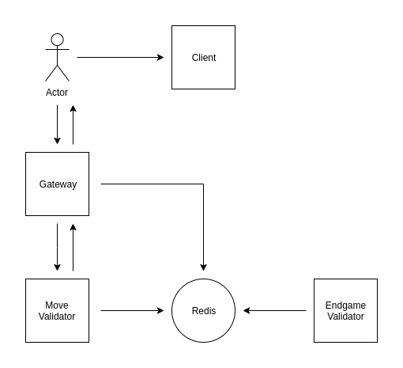

Overengineered Chess
====================

Why? Because we can.

# Design

This app is comprised of the following parts:

- Client (Angular)
- Gateway (Python FastAPI)
- Redis (Redis)
- Move Validator (Python FastAPI)
- Endgame Validator (Python)

  

The following chapters explain how each moving part functions.

## Client

TODO

## Gateway

Gateway is the entity which sits between the user and the rest of the app. It's responsible for game management - creation of new games, state of the current games and addition of new moves.

It exposes the following API endpoints:

- `WS   /game/{game_id}/create`: creates a Redis stream for a new game of chess where all moves will be stored and transmits performed moves to client via websocket
- `WS   /game/{game_id}/join`: establishes websocket connection through which game moves will be transmitted to client
- `POST /game/{game_id}/move`: delegates new move to move validator for further validation and addition to the game stream
- `POST /game/{game_id}/suggest`: returns a list of valid moves for a given chess piece

It reads the following environment variables:

- `REDIS_HOST`: redis host to work with (default: `localhost`)
- `REDIS_PORT`: port to use when connecting to redis (default: `6379`)
- `MOVE_VALIDATOR_ENDPOINT`: endpoint to query for move validation (default: `http://localhost:8001/validate`)

## Redis

The most quintessential deployment of Redis - single instance and non-persistent.

## Move Validator

Move validator does exactly that, validate chess moves. It builds game state out of performed moves and then decides if provided move is valid. It then returns response to gateway and notifies endgame microservice via redis stream.

It exposes the following API endpoints:

- `POST /validate`: makes sure provided move is valid, then notifies endgame validator and returns a success status code

It reads the following environment variables:

- `REDIS_HOST`: redis host to work with (default: `localhost`)
- `REDIS_PORT`: port to use when connecting to redis (default: `6379`)
- `ENDGAME_STREAM_NAME`: name for the redis stream to use to pass move notifications to endgame validator

## Endgame Validator

Endgame validator is a simple `while True` loop which listens on a Redis stream. It receives a message from move validator after a move has been performed and checks if the game has ended. If game has indeed ended, marks game as finished by setting expiration on the stream key.

It reads the following environment variables:

- `REDIS_HOST`: redis host to work with (default: `localhost`)
- `REDIS_PORT`: port to use when connecting to redis (default: `6379`)
- `ENDGAME_STREAM_NAME`: name for the redis stream to use to read move notifications from move validator
